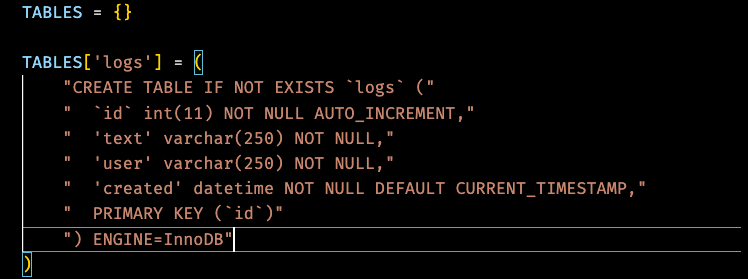

code gist
https://gist.github.com/bradtraversy/5ea2fa59776ddc8cf45c536be65d4f86

####Create a virtual environment
```
cd python_mysql
```
```
pipenv shell
```
#### Install mysql python connector
```
pipenv install mysql_connector_python
```

####Select the python interpreter


#### Create connection file


#### Create setup file


#### Run setup.py


#### Mysql_bench


#### Add tables



