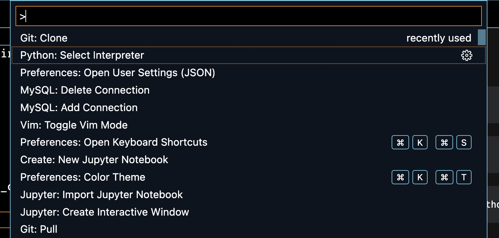
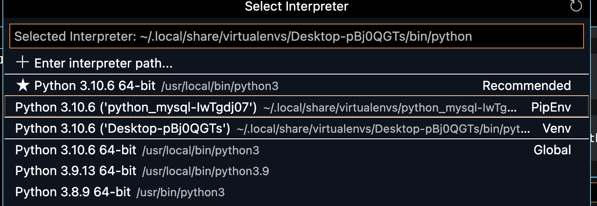
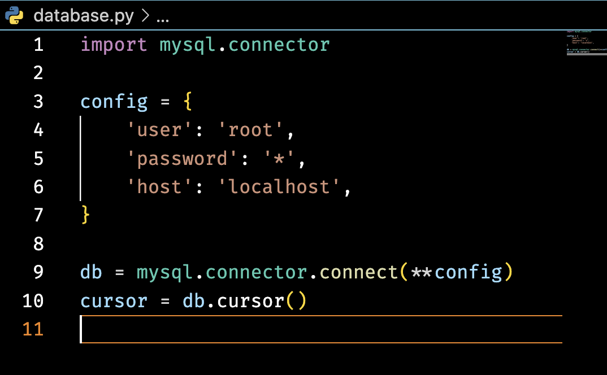
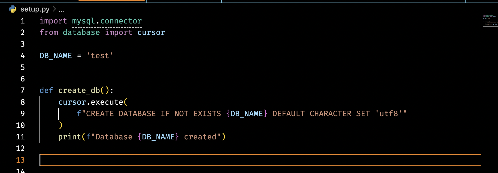

####Create a virtual environment
```
cd python_mysql
```
```
pipenv shell
```
#### Install mysql python connector
```
pipenv install mysql_connector_python
```

####Select the python interpreter



#### Create connection file


#### Create setup file


